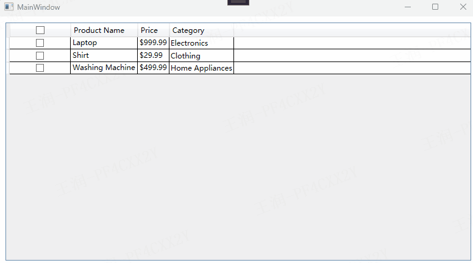

实现效果如下：


**注意**
默认情况下，CheckBoxColumn 单元格第一次点击时获取焦点，第二次点击时才会修改CheckBox的选中状态。未解决该问题，需要设置ElementStyle和EditingElementStyle。
```
<DataGridCheckBoxColumn.ElementStyle>
    <Style TargetType="CheckBox">
        <Setter Property="HorizontalAlignment" Value="Center"/>
        <Setter Property="VerticalAlignment" Value="Center"/>
    </Style>
</DataGridCheckBoxColumn.ElementStyle>
<DataGridCheckBoxColumn.EditingElementStyle>
    <Style TargetType="CheckBox">
        <Setter Property="HorizontalAlignment" Value="Center"/>
        <Setter Property="VerticalAlignment" Value="Center"/>
    </Style>
</DataGridCheckBoxColumn.EditingElementStyle>
```

